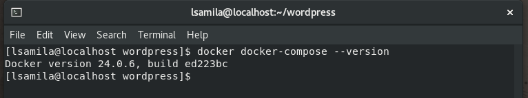
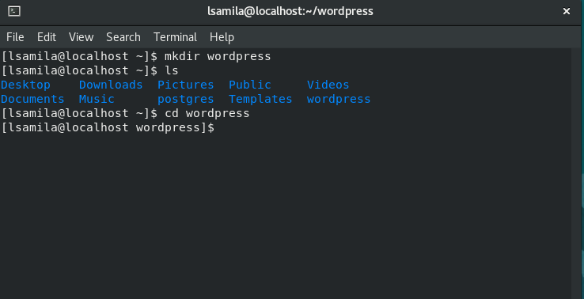
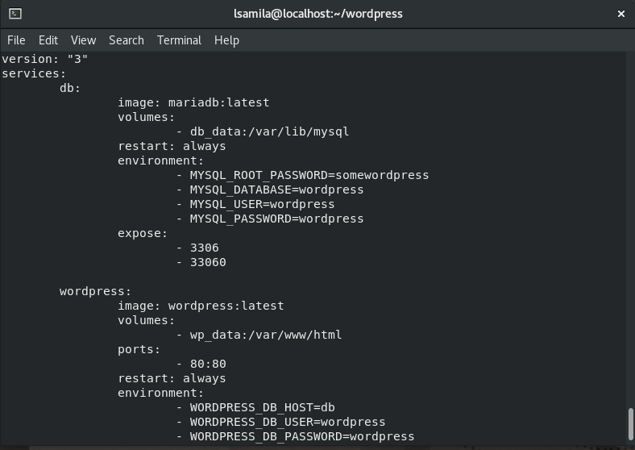
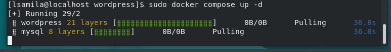
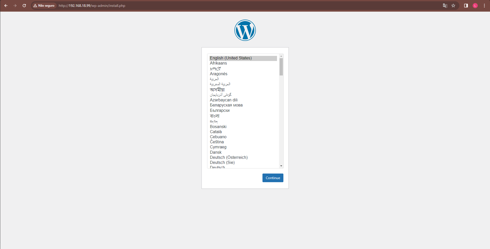
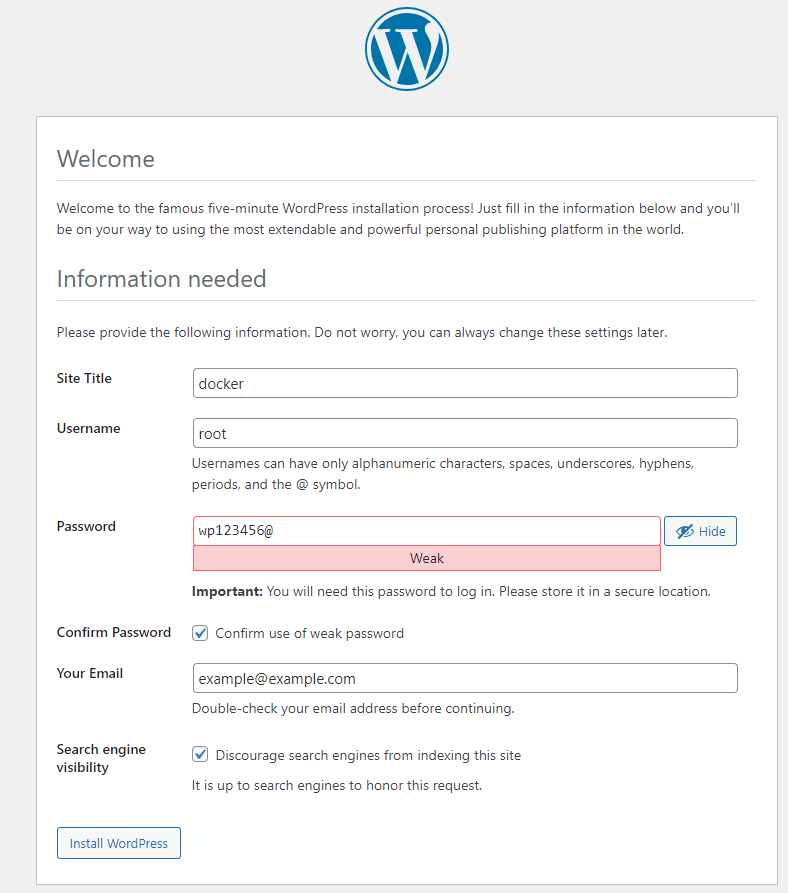
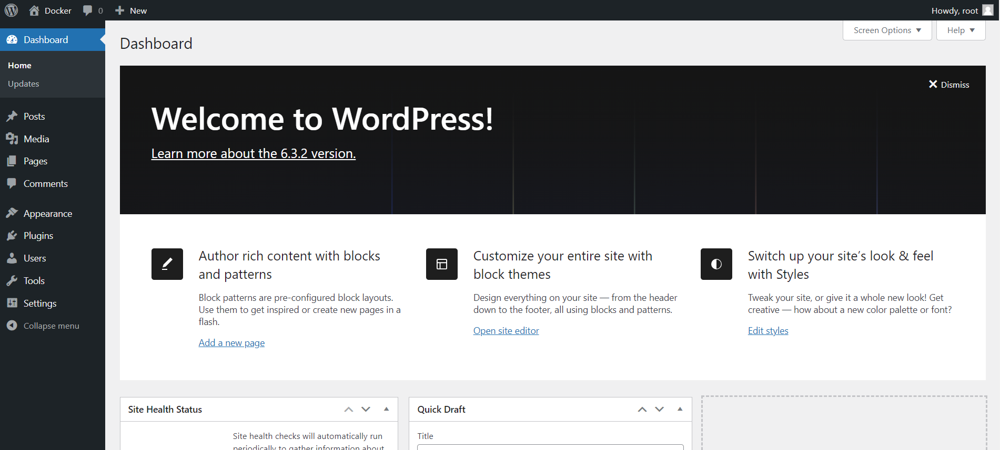
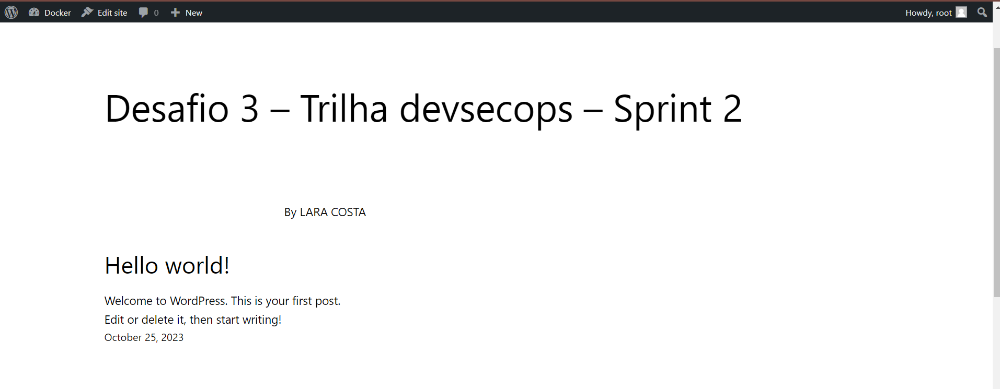
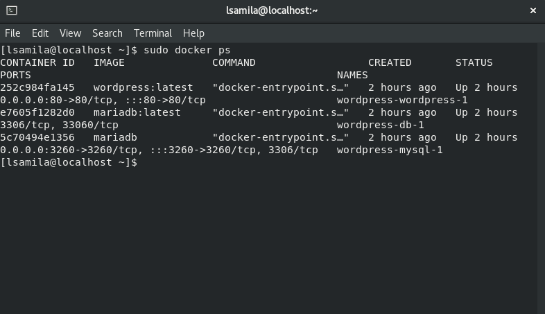
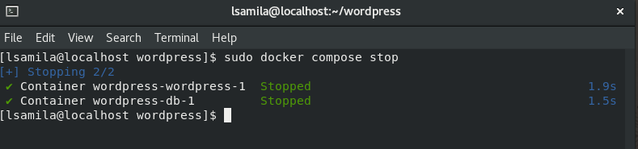

## Desafio 03 - Trilha DevSecOps na CompassUOL - Sprint 2


## Ferramentas necessárias:
[Docker](https://github.com/LaraCosta66/compass-docker-d01)

[Criar uma Imagem no Docker](https://github.com/LaraCosta66/compass-docker-d01)

### Verifique se possui o Docker compose instalado:


# Criar uma imagem do wordpress com banco de dados usando Docker Compose
### Crie um diretorio para começar:
- Depois vá para esse diretório

```
mkdir wordpress
cd wordpress
```


### Dentro do diretório **Wordpress**, crie o arquivo ***docker-compose.yml***
```
sudo vim docker-compose.yml
```
- Edite esse arquivo com as seguintes informações:
```
version: "3"
services:
  db:
    image: mariadb:latest
    volumes:
      - db_data:/var/lib/mysql
    restart: always
    environment:
      - MYSQL_ROOT_PASSWORD=somewordpress
      - MYSQL_DATABASE=wordpress
      - MYSQL_USER=wordpress
      - MYSQL_PASSWORD=wordpress
    expose:
      - 3306
      - 33060
  wordpress:
    image: wordpress:latest
    volumes:
      - wp_data:/var/www/html
    ports:
      - 80:80
    restart: always
    environment:
      - WORDPRESS_DB_HOST=db
      - WORDPRESS_DB_USER=wordpress
      - WORDPRESS_DB_PASSWORD=wordpress
      - WORDPRESS_DB_NAME=wordpress
volumes:
  db_data:
  wp_data:
```
- _Salve o arquivo e saia **ESC :wq**_



## Executar e construir a imagem:
```
sudo docker compose up -d
```


## No navegador

1. Coloque o ip da sua **maquina na url e a porta 80**, caso nao saiba:
- Use o comando:
```
ip address
```

- Na  url do seu navegador, ex.: 
```
192.168.1.1:80
```
### Configurando o wordpress

- Você será redirecionado para essa tela, **selecione o idioma** e **continue**:


- Segunda tela:

### Por fim, será redirecionado para a tela de Dashboard do wordpress


### Para verificar se o site está rodando, clique no **icone de casa** e ***visit site***



## Por fim você verá os containers rodando:

```
sudo docker ps
```


- Para **shutdown**:

```
sudo docker compose stop
```


## Desafio concluído